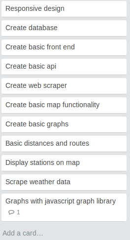
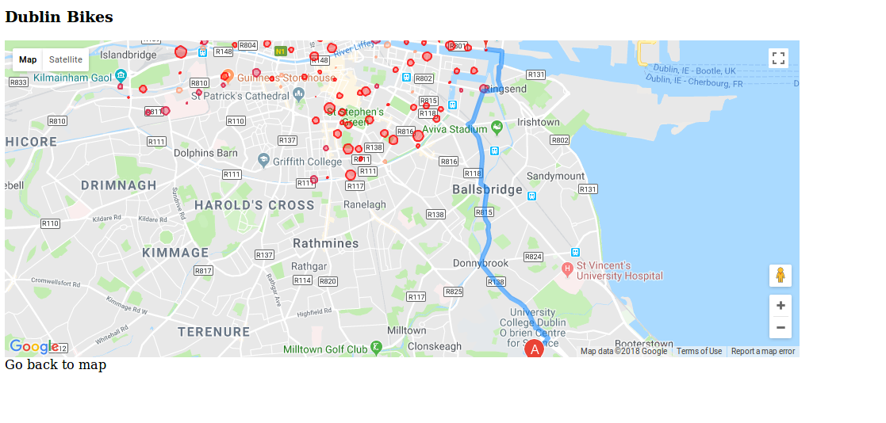

**Feb 27th 2018**

Successful first meeting. Began to create a project backlog. etc
However, it snowed thereafter and there were no face to face meetings until the next weekday.

Original product backlog on trello looked something like this...

**Tues 3rd April**

Lots of progress made. The snow break had been highly productive, and many of the essential features, and even a few of the ideal features had been struck from the project backlog. Issues had, however, been encountered.

e.g It was determined that html5 geolocator would not function within out a https domain.

Directions were working, but took about a minute to load and didn't return the nearest bike stand.

Markers windows contained graphs, but these graphs were ugly and wouldn't load automatically. In addition, the marker windows wouldn't close when you clicked on a new marker.

There were two versions of the front end in operation, and they looked like this -->

