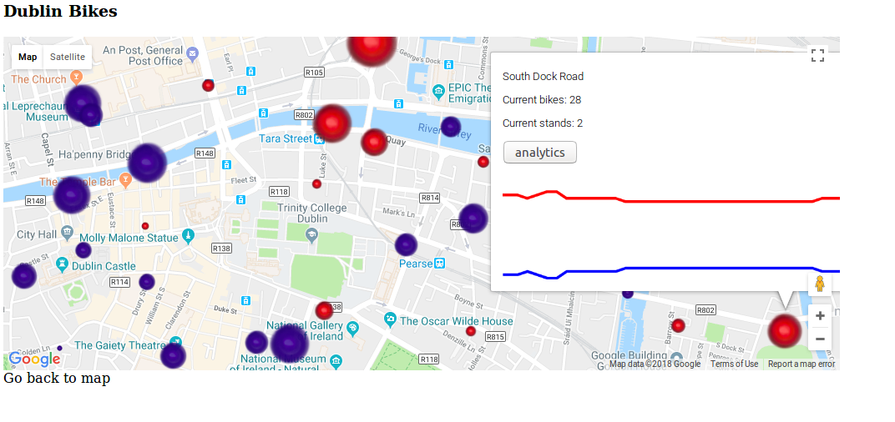

**March 27th 2018**

Met with Jake and discussed the project so far. Reviewed the project backlog from sprint 1. Made a new project backlog for sprint 2.
Louis has dropped out of the team. All else seems to be going well.

*Screenshots of the current front end -->*

*New project backlog includes -->*

